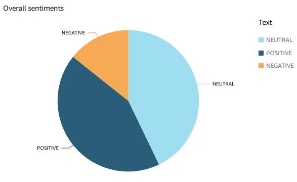
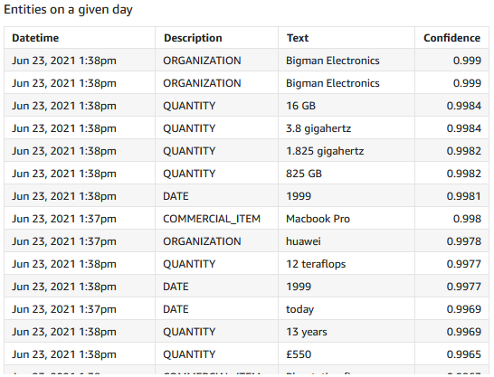
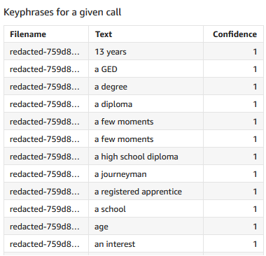
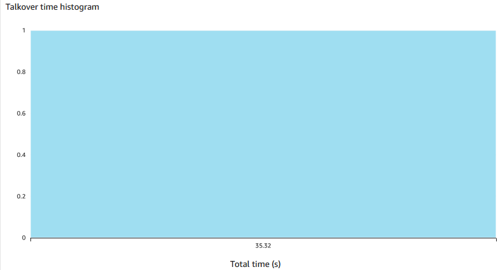
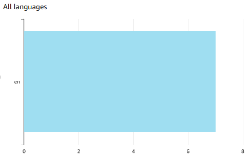
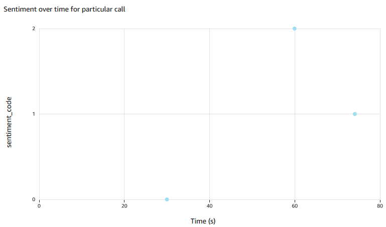

# aws-custom-calls
## Serverless AI services pipeline
A pipeline for analysing call center calls using AWS Machine Learning services. We use [AWS Transcribe](aws.amazon.com/transcribe/) for transcribing call center audio and elements of the [AWS Comprehend](https://aws.amazon.com/comprehend/) service for providing analytics. Custom analytics are built on top of AWS Comprehend to provide more relevant analytics. Insights of the analytics are published on [AWS Quicksight](aws.amazon.com/quicksight/).

The pipeline is implemented in the [AWS Serverless Application Model](https://aws.amazon.com/serverless/sam/) which provides a scalable and flexible way of deploying an AWS application. The Machine Learning services are called using [AWS Lambda](aws.amazon.com/lambda/) functions, as described below. Audio is ingested, transcriptions are stored and structured analytics are stored using [AWS S3](aws.amazon.com/s3/). The whole stack is deployed to [AWS CloudFormation](https://aws.amazon.com/cloudformation/).

See [Quick Startup](docs/C-CCASEdevquickstartup-020721-0912.pdf) for getting started.

## Structure

The event-driven AI pipeline is structured as follows,

1. Audio file dropped in input folder of transcription input S3 bucket.
2. Transcription services Lambda function transcribe_and_redact invoked by S3 trigger with prefix/suffix filter.
3. transcribe_and_redact performs transcription by calling **AWS Transcribe** via boto3. Transcription json output to input folder of comprehend input S3 bucket. Audio file copied to processed folder (if successful - TODO) and deleted from input (TODO [1]).
4. Comprehend + analytics services Lambda function redact_and_comprehend invoked by S3 trigger with prefix/suffix filter.
5. redact_and_comprehend performs **AWS Comprehend**-powered and custom analytics on transcriptions (including on different speakers, timings etc.). Analytics output to CSV file placed in output folder of comprehend output S3 bucket. Transcription moved to processed folder if successful.
6. **AWS Quicksight** Dataset configured on output folder of comprehend output S3 bucket which imports all analytics output CSVs.
7. Connected AWS Quicksight Analysis produces charts and graphs based on the raw imported data and various aggregates.

The folder structure should be as follows,
s3/
├── cti-transcribe-job-input/
│   └── transcribe_comprehend_pipeline/
│       ├── transcriptions_processed/
│       │   └── .wav
│       └── transcriptions_raw/
│           └── .wav
├── cti-comprehend-job-input/
│   └── transcribe_comprehend_pipeline/
│       ├── transcriptions_processed/
│       │   └── .json
│       └── transcriptions_raw/
│           └── .json
└── cti-comprehend-job-output/
    └── transcribe_comprehend_pipeline/
        └── output/
            └── .csv

### AWS S3 Locations

Transcription input bucket: https://s3.console.aws.amazon.com/s3/buckets/cti-transcribe-job-input
Comprehend input bucket: https://s3.console.aws.amazon.com/s3/buckets/cti-comprehend-job-input
Comprehend output bucket: https://s3.console.aws.amazon.com/s3/buckets/cti-comprehend-job-output

## Development

The Lambda functions are implemented in the AWS Serverless Application Model (SAM) hosted here. The two functions are at transcribe-comprehend-pipeline/transcribe_and_redact and transcribe-comprehend-pipeline/redact_and_comprehend. The Lambda configurations, including S3 triggers, timeout (TODO [2]) and IAM roles [3] are described in transcribe-comprehend-pipeline/template.yaml. From the AWS CLI, these are deployed to AWS CloudFormation using `sam deploy`. The CloudFormation stack is [here](https://eu-west-2.console.aws.amazon.com/cloudformation/home?region=eu-west-2#/stacks/stackinfo?stackId=arn%3Aaws%3Acloudformation%3Aeu-west-2%3A337847985510%3Astack%2Ftranscribe-comprehend-pipeline%2Ff80d0e30-ce9b-11eb-ad06-061b6b0df246). 

## Custom comprehend + analytics Lambda functionality

The Lambda function improves on the built-in capabilities of AWS Comprehend. These include:

- Performing PII extraction & redaction prior to any text-extraction analyses.
- Detecting dominant language, extracting entities and extracting key-phrases (with optional confidence threshold) on redacted transcript.
- Determining sentiment over time in one call, by breaking down call into chunks. Chunk length increases with call length and no chunks are split mid-sentence.
- Determining overall sentiment in a call by averaging over time.
- Determining how long speakers talk over each other (talkover time) and how often (talkover count) (requires multi-channel transcription which in turn requires multi-channel audio).
- Determining individual speaker sentiment (requires at least multi-speaker transcription).

## Quicksight Analysis and Dashboard

The current Quicksight Dataset reads raw CSVs from folder and can be manually or automatically refreshed to ingest new data. Quicksight must be configured to have a role with the correct policy to read the S3 bucket. Currently the CSV columns read as follows: `Filename,Datetime,Job,Description,Value,Text,Confidence` from which a Quicksight Analysis is easily and quickly created. Graphs and charts are created by drag-and-dropping fields and creating filters. Publish an Analysis to create a Dashboard, which can be exported in Enterprise Edition.

Scatter plot of Value on X vs `sentiment_code` (calculated field embedding sentiment text) on Y. Filters: Job-`sentiment_chunk`,Description-`sentiment`,Filename-`redacted-....json`

## Notes

[1] This is more difficult due to AWS Transcribe transcription being an asynchronous service.

[2] This is TODO for comprehend and analytics Lambda function as the current 5 seconds timeout may be too short for longer transcriptions that
will take more than 5 seconds to execute. Possible solutions: (1) use batch jobs for the most time-consuming jobs; (2) use another event-driven
Lambda to move the files; (3) use AWS Step Functions to orchestrate the functions.

[3] Currently, one IAM role is used which covers S3 read/write, Transcribe and Comprehend.

